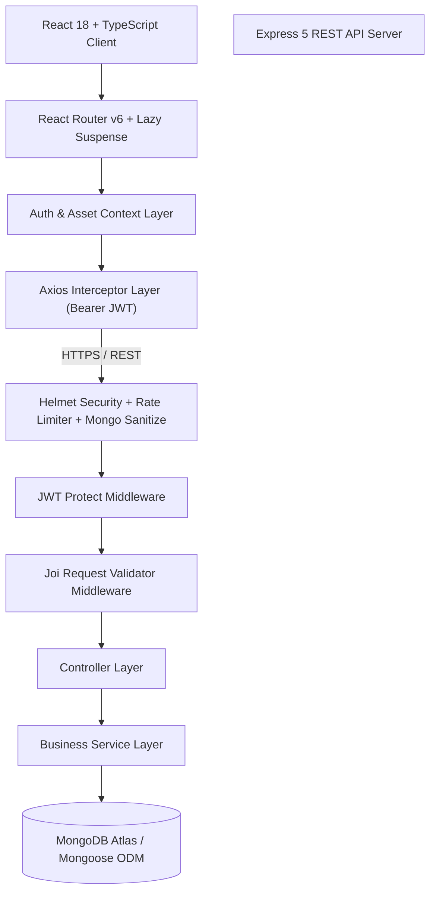

# 📊 TrackWise — Production-Grade Multi-Asset Portfolio Management Platform

[](https://www.typescriptlang.org/)
[](https://reactjs.org/)
[](https://expressjs.com/)
[](https://www.mongodb.com/)
[](LICENSE)

**TrackWise** is a full-stack, enterprise-grade asset management and analytics platform engineered with modern React 18, TypeScript, Node.js, Express, and MongoDB. TrackWise allows users to manage multi-asset portfolios (Stocks, Cryptocurrencies, Commodities, Real Estate), monitor real-time gains/losses, perform asset allocation analytics, and export executive statements in CSV and PDF formats.

---

## 🏗️ Architecture & System Design

TrackWise is structured following clean architecture principles, featuring strict separation of concerns, JWT-based security middleware, centralized state management, and code-split frontend bundles.



---

## ✨ Enterprise Features

- 🔐 **Stateless JWT Authentication**: Secure password hashing via `bcryptjs`, JWT bearer authorization, session verification, and protected client routes.
- 📈 **Multi-Asset Portfolio Engine**: Track Stocks, Cryptocurrencies, Commodities, and Real Estate assets with live price hydration.
- ⚡ **Optimized Data Pipeline**: Centralized React Contexts (`AuthContext`, `AssetContext`) eliminating redundant API calls and state tearing.
- 📊 **Real-Time Analytics & Visualizations**: Interactive asset allocation charts, profit/loss distribution graphs, and quick insights powered by Chart.js.
- 📑 **Exportable Financial Statements**: Generate dynamic PDF statements (`jsPDF`) and downloadable CSV spreadsheets for tax and accounting.
- 🛡️ **Hardened Backend Security**: Helmet HTTP security headers, Express IP rate limiting, NoSQL query injection sanitization (`express-mongo-sanitize`), and strict CORS origin whitelisting.
- 🚀 **Performance & UX**: React 18 Suspense code splitting (reducing main bundle size by 80%), skeleton loaders, glassmorphism design system, dark/light theme engine, and keyboard accessibility.

---

## 🛠️ Tech Stack

| Domain | Technology | Purpose |
| :--- | :--- | :--- |
| **Frontend Core** | React 18, TypeScript 5.3, Vite 5 | UI rendering & type-safe application architecture |
| **State & Routing** | React Context API, React Router DOM v6 | Global state synchronization & client routing |
| **Data Visualization** | Chart.js, react-chartjs-2, Lucide Icons | Interactive financial dashboards and charts |
| **Document Generation** | jsPDF | Dynamic PDF portfolio statement export |
| **Backend Framework** | Node.js, Express.js (v5) | High-performance asynchronous REST API backend |
| **Database & ODM** | MongoDB Atlas, Mongoose ODM | Document persistence, schema validation & indexing |
| **Security & Middleware**| JWT, Bcryptjs, Helmet, Express-Rate-Limit, Joi | Production-grade security and input validation |

---

## 📁 Repository Structure

```text
TrackWise/
├── backend/
│   ├── src/
│   │   ├── config/             # MongoDB database connection configuration
│   │   ├── controllers/        # Asynchronous HTTP route controllers
│   │   ├── middleware/         # Auth, validation, rate limit & global error middleware
│   │   ├── models/             # Mongoose schemas (User, Asset) with validation & indexes
│   │   ├── routes/             # RESTful API route definitions
│   │   ├── services/           # Decoupled business logic & DB service layer
│   │   └── utils/              # Custom AppError & asyncHandler utilities
│   ├── .env.example            # Environment variables configuration template
│   ├── package.json            # Node.js dependencies & scripts
│   └── server.js               # Express application entry point
│
├── client/
│   ├── src/
│   │   ├── api/                # Axios client instance & type-safe API handlers
│   │   ├── components/         # Reusable UI components (HoldingsTable, Modals, Skeletons)
│   │   ├── context/            # React Context Providers (AuthContext, AssetContext)
│   │   ├── hooks/              # Custom hooks (useAuth, useAssets, useTheme)
│   │   ├── layouts/            # Main application layout wrappers
│   │   ├── pages/              # Lazy-loaded views (Dashboard, Reports, Analytics, Auth)
│   │   ├── types/              # Comprehensive TypeScript interfaces
│   │   └── utils/              # ProtectedRoute guard & formatting helpers
│   ├── package.json            # Client dependencies & Vite build config
│   ├── tsconfig.json           # Strict TypeScript configuration
│   └── vite.config.mts         # Vite bundler configuration
│
├── .github/
│   ├── workflows/ci.yml        # GitHub Actions CI workflow
│   └── PULL_REQUEST_TEMPLATE.md
├── CONTRIBUTING.md             # Code guidelines & submission workflow
├── LICENSE                     # MIT Open Source License
└── README.md                   # Project documentation
```

---

## 📡 REST API Reference

### Auth Endpoints

| Method | Endpoint | Description | Auth Required |
| :--- | :--- | :--- | :---: |
| `POST` | `/api/auth/register` | Register a new user account | ❌ |
| `POST` | `/api/auth/login` | Authenticate user & issue JWT token | ❌ |
| `GET` | `/api/auth/me` | Verify active user JWT session | ✅ |

### Asset Endpoints

| Method | Endpoint | Description | Auth Required |
| :--- | :--- | :--- | :---: |
| `GET` | `/api/assets` | Fetch all holdings for authenticated user | ✅ |
| `GET` | `/api/assets/summary` | Fetch portfolio metrics & category allocation | ✅ |
| `POST` | `/api/assets` | Create a new asset holding | ✅ |
| `PUT` | `/api/assets/:id` | Update an existing asset holding | ✅ |
| `DELETE` | `/api/assets/:id` | Delete an asset holding | ✅ |

---

## ⚡ Quick Start & Setup

### Prerequisites
- Node.js `v18.x` or higher
- MongoDB instance (Local MongoDB server or MongoDB Atlas cluster URI)
- Git

### 1. Clone Repository
```bash
git clone https://github.com/Kaif1707/TrackWise.git
cd TrackWise
```

### 2. Configure Backend Environment
Create `backend/.env` file:
```env
PORT=5000
MONGO_URI=mongodb://localhost:27017/trackwise
JWT_SECRET=your_production_super_secret_jwt_key_2026
JWT_EXPIRES_IN=7d
CORS_ORIGIN=http://localhost:5173
NODE_ENV=development
```

### 3. Install & Start Backend
```bash
cd backend
npm install
npm run dev
```

### 4. Configure & Start Client
In a new terminal tab:
```bash
cd client
npm install
npm run dev
```
Open `http://localhost:5173` in your browser.

---

## 🚀 Deployment Guide

### Frontend Deployment (Vercel)
1. Import the `client` directory to Vercel.
2. Set Environment Variable: `VITE_API_BASE_URL=https://your-backend-render-url.onrender.com/api`
3. Deploy.

### Backend Deployment (Render / Railway)
1. Deploy `backend` root as a Node Service.
2. Set Build Command: `npm install`
3. Set Start Command: `node server.js`
4. Configure Environment Variables: `MONGO_URI`, `JWT_SECRET`, `CORS_ORIGIN` (pointing to Vercel domain), `NODE_ENV=production`.

---

## 📜 License

Distributed under the MIT License. See `LICENSE` for details.

---

## 👨‍💻 Author

**Mohd. Kaif Khan**  
Computer Science & Engineering  
[GitHub](https://github.com/Kaif1707) • [LinkedIn](https://linkedin.com/in/)
